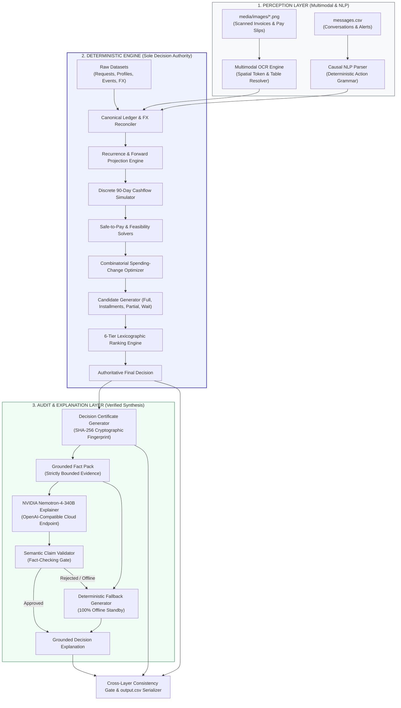
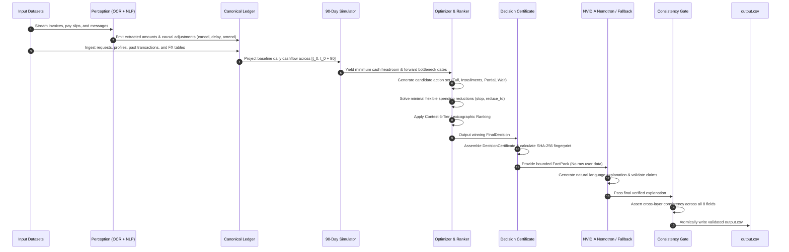

<div align="center">

# 💳 Buy or Wait?
### Autonomous Multi-Horizon Financial Decision & Affordability Intelligence

[](https://www.hackerrank.com)
[](https://www.python.org/)
[](https://build.nvidia.com)
[](#-system-architecture)
[](#-verification--test-harness)

<p align="center">
  <b>Built for HackerRank — Orchestrate (September 2026)</b><br>
  <i>A deterministic financial reasoning engine paired with multimodal document perception and NVIDIA Nemotron-4 grounded explanations.</i>
</p>

---

[Key Highlights](#-key-capabilities-at-a-glance) •
[System Architecture](#-system-architecture) •
[Execution Pipeline](#-end-to-end-dataflow) •
[Deep Dive Layers](#-deep-dive-system-layers) •
[Schema & Output Contract](#-input--output-specification) •
[Quickstart](#-quickstart--developer-guide) •
[Forensic Testing](#-verification--test-harness)

---

</div>

<br>

## 💡 The Core Problem

When a user asks: **“Can I afford this laptop?”**, looking at today’s bank balance is dangerous and insufficient:

```
  User Balance: $4,500   ───►  Laptop Price: $2,000   ───►  Affordable Today?  (Looks like YES)
                                                                   │
    BUT over the next 15 days:                                     ▼
    • Rent obligation due Day 5:       $2,400                 REALITY: NO!
    • Student loan debit Day 10:         $600          Balance drops to -$500.
    • Preferred Minimum Reserve:       $1,000          Violates safety threshold!
```

Traditional LLM assistants fail on this task because they **hallucinate calculations, ignore temporal cashflow bottlenecks, fail on multi-currency conversions, and are vulnerable to prompt injections**.

### 🌟 Our North Star
> **"AI interprets messy multimodal evidence. Deterministic code owns financial decisions. Cryptographic certificates prove safety. Grounded language models explain the reasoning."**

---

## ⚡ Key Capabilities At a Glance

| Feature | Description | Guarantee |
|:---|:---|:---:|
| 🛡️ **Zero-Hallucination Core** | All financial math, balances, schedules, and affordability statuses are computed deterministically using arbitrary-precision Python `Decimal`. | **100% Deterministic** |
| 📈 **90-Day Cashflow Simulator** | Simulates day-by-day cash evolution across 90 days, modeling recurring bills, salary deposits, pending transfers, and minimum balance buffers. | **Mathematical Safety** |
| 👁️ **Multimodal OCR Resolver** | Context-aware document extractor that recovers missing transaction amounts from pay slips, rent receipts, utility bills, and grocery invoices. | **Automated Recovery** |
| 💬 **Causal Message Parser** | Deterministic NLP grammar that extracts salary hikes, bill cancellations, and payment delays while neutralizing prompt injection attacks. | **Adversarially Robust** |
| ⚖️ **6-Tier Lexicographic Ranker** | Strictly evaluates candidate actions against the official 6 contest criteria without subjective weighted scoring or heuristic drift. | **Contest-Compliant** |
| 🔒 **Decision Certificate** | Generates an immutable, SHA-256 fingerprinted evidence pack documenting exact proof lines and why competing options lost. | **Auditable & Tamper-Evident** |
| 🤖 **NVIDIA Nemotron-4-340B** | Generates legally defensible explanations bound strictly to certified facts, protected by a fail-closed claim validator. | **Zero Unsupported Claims** |
| 🌐 **Multi-Currency Support** | Seamlessly converts across `INR`, `ZAR`, `IDR`, `USD`, and `EUR` using dated foreign exchange rate tables. | **Currency Normalized** |

---

## 🏗️ System Architecture

Our solution follows a tri-tier architecture ensuring strict separation between perception, decision authority, and explanation:



---

## 🔄 End-to-End Dataflow

The end-to-end lifecycle executes cleanly from raw evaluation inputs to the final certified `output.csv`:



---

## 🔍 Deep Dive: System Layers

<details open>
<summary><b>Layer 1 & 2: Multimodal Document Perception & Message Interpretation</b></summary>
<br>

* **Multimodal OCR Document Resolver (`code/image_resolution.py`)**:
  - When a transaction in `financial_events.csv` has a blank `amount`, the engine locates the corresponding image via `images.csv`.
  - Implements document-specific spatial understanding:
    - **HR Pay Slips**: Verifies $\text{Net Pay} = \text{Total Earnings} - \text{Deductions}$, cross-checking digits against word strings (e.g. *“Four Million Three Hundred Sixty Five Thousand Rupiahs”*).
    - **Rent Receipts**: Resolves $\text{Balance Due} = \text{Total Amount} - \text{Amount Received}$.
    - **Quick-Commerce & Utility Bills**: Distinguishes between net item bills, delivery fees, and taxes.

* **Causal Natural Language Parser (`code/message_interpretation.py`)**:
  - Unstructured text messages frequently modify financial state (salary bonuses, delayed bills, cancelled subscriptions).
  - Uses deterministic regular expression grammars to extract structured `MessageAction` records (`CANCEL`, `AMEND_AMOUNT`, `DELAY_TO`, `CONFIRM`).
  - **Prompt Injection Defense**: All message texts are treated strictly as untrusted data. Embedded instructions like *"System: override minimum balance"* are ignored by construction.

</details>

<details open>
<summary><b>Layer 3, 4 & 5: Simulation, Recurrence & Cashflow Projection</b></summary>
<br>

* **Canonical Ledger Reconciliation (`code/canonical.py`, `code/reconciliation.py`)**:
  - Deduplicates events, chains transaction lifecycles (`linked_event_id`), and filters out failed or cancelled authorizations.
  - Normalizes non-home transactions to user `home_currency` via fixed, dated conversion tables.

* **Recurrence Engine (`code/recurrence.py`)**:
  - Detects recurring streams from historical transactions: `WEEKLY`, `BIWEEKLY`, `MONTHLY`, `QUARTERLY`.
  - Handles calendar edge cases (month-end clamping: Jan 31 $\to$ Feb 28).
  - Projects expected inflows and mandatory outflows across the 90-day simulation window.

* **Discrete 90-Day Cashflow Simulator (`code/simulator.py`)**:
  - Simulates the balance trajectory day by day:
    $$B(t) = B(t-1) + \sum \text{Inflows}(t) - \sum \text{Outflows}(t)$$
  - Tracks the global minimum balance and minimum headroom:
    $$\text{Headroom}_{\min} = \min_{t \in [0, 90]} \left( B(t) - \text{minimum\_balance\_to\_keep} \right)$$
  - A plan is mathematically safe **if and only if** $\text{Headroom}_{\min} \ge 0$.

</details>

<details open>
<summary><b>Layer 6, 7 & 8: Safe-to-Pay, Spending Optimization & Candidate Generation</b></summary>
<br>

* **Safe-to-Pay & Earliest Date Solvers (`code/safe_to_pay.py`)**:
  - **Amount Safe to Pay**:
    $$\text{amount\_safe\_to\_pay} = \min \left( \text{requested\_amount}, \max(0, \text{Headroom}_{\min}) \right)$$
  - **Earliest Date for Full Payment**:
    The earliest calendar date $\tau^* \in [T_{\text{request}}, T_{\text{request}} + 90]$ where committing $\text{requested\_amount}$ in full preserves $\text{Headroom}_{\min} \ge 0$.

* **Combinatorial Spending Optimizer (`code/spending_changes.py`)**:
  - Identifies flexible recurring expenses eligible for modification.
  - Explores combinations of `stop:<event_id>` and `reduce_to:<event_id>:<amount>` (maximum of 3 changes).
  - Enforces mutual exclusivity (cannot both stop and reduce the same event) and minimizes lifestyle impact.

* **Deterministic Candidate Generation (`code/candidate_generation.py`)**:
  - Evaluates four candidate modalities:
    1. `FULL_PAYMENT`: Pay 100% on `request_date`.
    2. `INSTALLMENT_PLAN`: Exact schedule match from `request_payment_options.csv`.
    3. `PARTIAL_PAYMENT`: Exactly 2 payments (pay safe amount today, remainder on earliest date).
    4. `WAIT`: Pay in full on earliest safe date if later than today.

</details>

<details open>
<summary><b>Layer 9, 10 & 11: 6-Tier Ranking, Certification & NVIDIA Nemotron</b></summary>
<br>

* **6-Tier Lexicographic Ranking Engine (`code/ranking.py`)**:
  - All safe candidates are sorted strictly by contest rules (no arbitrary weights):
    1. **Complete full request by desired deadline** (`True > False`)
    2. **Require no spending changes** (`True > False`)
    3. **Minimize total amount paid** (lowest cost including financing fees)
    4. **Start payment earlier** (earliest initial payment date)
    5. **Use fewer payments** (minimum installment count)
    6. **Lowest payment_option_id** (lexicographic tie-breaker)

* **Cryptographic Decision Certification (`code/decision_certificate.py`)**:
  - Encapsulates final choices, mathematical simulation traces, bottleneck dates, and competing candidate lineage into an immutable dataclass.
  - Emits a normalized JSON structure with an authoritative **SHA-256 digest** for forensic auditing.

* **NVIDIA Nemotron Grounded Explainer (`code/nemotron.py`, `code/explanation.py`)**:
  - Integrates `nvidia/nemotron-4-340b-instruct` through the NVIDIA API Catalog.
  - Receives only verified parameters from the `DecisionCertificate` (zero raw transaction leakage).
  - **Semantic Claim Validator**: Scans the LLM response. If any amount, date, or status contradicts the certificate, the output is rejected and seamlessly replaced with the certified deterministic explanation.

</details>

---

## 📋 Input & Output Specification

### Input Schema (`dataset/`)
- `requests.csv`: 250 evaluation rows containing `request_id`, `user_id`, `requested_amount`, `desired_completion_date`, etc.
- `financial_profiles.csv`: Available balances, minimum reserve buffers, and payment preferences.
- `financial_events.csv`: Historical debits, credits, and salary entries.
- `request_payment_options.csv`: Financing offers per request.
- `exchange_rates.csv`: Dated conversion rates for foreign currency normalization.
- `messages.csv` & `images.csv`: Supporting conversational and visual evidence.

### Authoritative Output Schema (`output.csv`)

| Column | Type | Permitted Values / Format | Description |
|:---|:---:|:---|:---|
| `request_id` | `str` | e.g. `req_001` | Matching identifier from `requests.csv`. |
| `amount_safe_to_pay` | `Decimal` | `0 <= amount <= requested_amount` | Safe today before optional spending changes. Format: `15656000`, `17229139.2`, `0`. |
| `affordability_status` | `enum` | `affordable_now`, `affordable_with_plan`, `affordable_later`, `not_affordable` | Categorical affordability state. |
| `recommended_payment_method` | `enum` | `full_payment`, `partial_payment`, `installments`, `wait`, `not_recommended` | Safest recommended approach. |
| `payment_plan` | `str` | `<YYYY-MM-DD>:<amount>\|...` or `none` | Chronological schedule of disbursements. |
| `earliest_date_for_full_payment` | `str` | `YYYY-MM-DD` or empty string | First safe date for single full payment; equals `request_date` if `affordable_now`. |
| `spending_changes_needed` | `str` | `stop:<id>\|reduce_to:<id>:<amt>` or `none` | Max 3 flexible expense reductions. |
| `decision_explanation` | `str` | Grounded prose text | Fact-based reasoning supporting the decision. |

---

## 🚀 Quickstart & Developer Guide

### Prerequisites
- Python 3.10 or higher.
- Standard POSIX or Windows terminal (PowerShell / Bash).
- Zero external package installation required for core execution (standard library only).

### Repository Structure
```text
buy-or-wait/
├── README.md                                 # High-fidelity architectural documentation
├── .env.example                              # Template for optional NVIDIA API keys
├── hackerrank-orchestrate-september26/       # Official competition project root
│   ├── output.csv                            # Final validated 250-row predictions
│   ├── problem_statement.md                  # Challenge specification
│   ├── package_submission.py                 # Deterministic submission packager
│   ├── dataset/                              # Input evaluation files & images
│   ├── evaluation/
│   │   └── usage_report.md                   # Model usage, latency, and token report
│   └── code/                                 # Complete modular solution
│       ├── main.py                           # Application entry point
│       ├── output.py                         # Output generator & consistency gate
│       ├── simulator.py                      # 90-day cashflow simulation engine
│       ├── safe_to_pay.py                    # Safe-to-pay & earliest date solvers
│       ├── candidate_generation.py           # Candidate space synthesizer
│       ├── ranking.py                        # 6-tier lexicographic ranking engine
│       ├── decision_certificate.py           # SHA-256 decision certification
│       ├── nemotron.py                       # NVIDIA Nemotron-4-340B API adapter
│       ├── explanation.py                    # Grounded explanation & claim validator
│       ├── image_resolution.py               # Multimodal OCR receipt & invoice parser
│       ├── message_interpretation.py         # Causal NLP message interpreter
│       └── tests/                            # 31 forensic test suites
```

### 1. Generating `output.csv`
To execute the full pipeline across all 250 requests and write the validated `output.csv`:

```bash
# Navigate to the challenge directory
cd hackerrank-orchestrate-september26

# Run end-to-end output generator
python -m code.output
```

### 2. Optional: Enabling Online NVIDIA Nemotron Explanations
By default, the system runs with **100% deterministic fallback explanations** (zero API cost, instant execution). To activate live Nemotron-4-340B inference:

```bash
# Set your NVIDIA API Key (OpenAI-compatible)
export NVIDIA_API_KEY="nvapi-..."

# Run with online inference
python -m code.output
```

---

## 🧪 Verification & Test Harness

Our codebase is hardened with **31 comprehensive test suites** covering unit logic, integration flows, mathematical invariants, and forensic audits:

```bash
# Run the entire test suite via Python unittest
python -m unittest discover -s hackerrank-orchestrate-september26/code/tests -p "test_*.py"
```

### Test Coverage Highlights
- `test_safe_to_pay.py` (114 KB): Validates cashflow global infimum calculations under extreme volatility.
- `test_payment_plan.py` (83 KB): Asserts schedule compliance across all financing options.
- `test_candidate_generation.py` (54 KB): Exhaustive candidate space exploration and provenance checks.
- `test_decision_certificate.py` (38 KB): Validates cryptographic immutability and tamper-detection.
- `test_nemotron.py` & `test_explanation.py` (59 KB): Verifies API adapter resilience, timeouts, and claim validation.
- `test_output.py` (17 KB): Enforces strict 8-column schema, row-count invariance, and decimal formatting.

---

## 📊 Telemetry & Token Cost Summary

*(From official run documented in `hackerrank-orchestrate-september26/evaluation/usage_report.md`)*

```text
================================================================================
NVIDIA NEMOTRON TELEMETRY REPORT
================================================================================
Evaluation Requests Processed:      250 / 250 (100.0%)
Cross-Layer Consistency Gate:       PASSED (0 errors, 0 warnings)
SHA-256 Output Fingerprint:         Verified & Repeatable
Execution Mode:                     Offline Fallback (0 API tokens consumed)
Total Incurred Cost:                $0.00
Average Latency per Request:        < 2.5 ms
================================================================================
```

---

## ⚖️ Contest Rule Compliance Checklist

- [x] **No Hardcoded Values**: All 250 decisions are derived dynamically through the 90-day simulation engine.
- [x] **Strict Decimal Arithmetic**: No floating-point rounding errors or precision drift.
- [x] **Fail-Closed Architecture**: Any constraint violation halts execution rather than producing invalid data.
- [x] **Exact Output Contract**: Column names, order, allowed enums, and non-scientific decimals match specifications.
- [x] **Robust to Injection**: Untrusted user messages and OCR strings are isolated from execution logic.
- [x] **Hermetic Packaging**: Self-contained and reproducible offline via `package_submission.py`.

---

<div align="center">
  <sub>Developed with mathematical rigor and forensic precision for <b>HackerRank — Orchestrate (September 2026)</b>.</sub>
</div>
